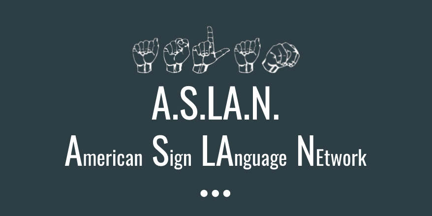
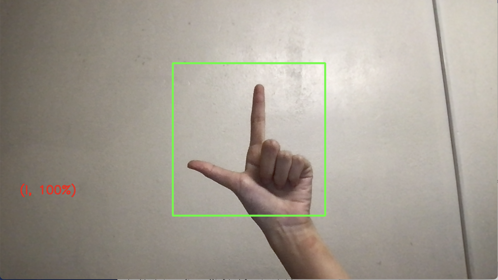

# ASLAN: American Sign LAnguage Network
A convolutional neural network model to recognize the letters of the American Sign Language alphabet

## Introduction
We hope to implement a convolutional neural network to classify the letters of the American Sign Language alphabet. We chose this topic because we feel that deep learning has the potential to improve quality of living for the deaf community by providing an easier way to communicate with those who may not know ASL.

## Installing required dependencies
- `Python 3.7.8` recommended
- Run `pip install -r requirements.txt` in the project root directory

## Camera

- Run `python3 camera.py` in the `code` directory
- Start signing in the highlighted box!!

## Downloading the datasets

### Sign Language MNIST
- Head over to this [link](https://www.kaggle.com/datamunge/sign-language-mnist/download) with a valid Kaggle account to download the dataset. 
- Unzip the downloaded `archive.zip`, rename the directory to `data/`, and move it to the project root directory

### ASL Finger Spelling Dataset
- Heads up! The dataset is fairly large (2.25 GB)
- Run `wget https://www.cvssp.org/FingerSpellingKinect2011/fingerspelling5.tar.bz2` in the project root directory
- Extract the file by running `tar xvjf fingerspelling5.tar.bz2`

## Recording a custom dataset
- change the configuration file in `code/constants.py`, updating the `project_dir`, `cur_letter` being recorded, and `sample_interval` (in milliseconds)
- run `python3 recordData.py` in the `code` directory
- A counter will display the number of snapshots recorded in the current section

## Preprocessing
- `get_data` can be used to retrieve the Sign Language MNIST dataset
- `get_data_2` can be used to retrieve the ASL Finger Spelling dataset

## Training
- Run `python3 main.py` in the `code` directory

